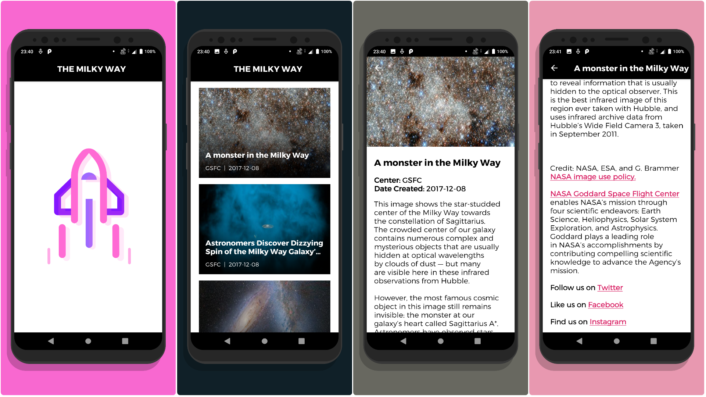

# Elon

An Android app that shows a list of Milky Way images taken in 2017.

You can find the APK file in [Releases](https://github.com/bapspatil/Elon/releases) or in the root directory.

A modified `gradle.properties` file is included in Git only for the purpose of demonstrating how I've made Gradle builds faster.

`ktlint.gradle` is included to enforce better Kotlin codestyle and linting.

## Screenshots

## Architecture

> MVI + Architecture Components (ViewModel & Lifecycle-aware components) + Dagger 2 + RxJava 2 + Retrofit

I've used MVI architecture for this app because it has better state management and makes use of ViewModels and view states to acheive the same.

MVI is short for Model-View-Intent. Here, Intent means the intention with which we're performing certain actions in our app; not [`Intent`](https://developer.android.com/reference/android/content/Intent), as in the Android object.

Repositories are used to make network calls for now. They can also be extended to make database calls in the future.

Use Cases are used to perform business logic operations on the data obtained from the repositories.

UI & unit tests are written for every single aspect of the app.

### Why didn't I choose MVP or MVVM?

Great question!

Testing with MVP (Model-View-Presenter) is hard. Also, MVP requires you to have one View in every Presenter.

MVVM (Model-View-ViewModel) is better than MVP in the sense that it doesn't require you to have a View for each ViewModel, but there is the problem of state synchronization. The state between the View and the ViewModel tends to be out of sync if the code isn't robust.

### So how does MVI solve this issue?

That's another fantastic question, you're on quite a roll! 

MVI solves the state synchronization issue by storing states as model classes, in the form of Kotlin sealed classes. We modify the state with our ViewModel based on certain events and then render the View by observing the state in our View.

To read more about MVI, why it's a good architecture and how it solves the state synchronization issue, you can find the article by Hannes Dorfmann here:  
[Model-View-Intent on Android](http://hannesdorfmann.com/android/model-view-intent)

## Libraries Used

### [AndroidX](https://developer.android.com/jetpack/androidx/)

This app uses AndroidX libraries with modules like `appcompat`, `core-ktx`, `constraintlayout`, `cardview`, `recyclerview` and `swiperefreshlayout`.

### [Architecture Components](https://developer.android.com/topic/libraries/architecture)

Android Architecture Components like ViewModel and Lifecycle-aware components are implemented in this app for a more robust, testable and maintainable codebase.

### [Dagger 2](http://dagger.dev)

Dagger 2 is responsible for Dependency Injection throughout the app. It is also used in UI testing to inject dependencies for Activities.

### [Retrofit](https://github.com/square/retrofit)

Retrofit with GSON is used for networking in the app to make API calls to the NASA service.

### [OkHttp](https://square.github.io/okhttp/)

Although Retrofit is dependent on OkHttp and comes with OkHttp included, I've only included the `logging-interceptor` module to log all body-level details related to the network calls.

### [RxJava 2](https://github.com/ReactiveX/RxJava)

RxJava 2 is used for Reactive Programming throughout this app. You'll find most of its usages in ViewModels, Use Cases and Repositories. It also works with Retrofit to adapt API responses into Observables.

### [RxAndroid](https://github.com/ReactiveX/RxAndroid)

I've used this because RxAndroid adds the minimum classes to RxJava that make writing reactive components in Android applications easy and hassle-free. More specifically, it provides a `Scheduler` that schedules on the main thread or any given `Looper`.

### [RxRelay](https://github.com/JakeWharton/RxRelay)

Relays are RxJava types which are both an `Observable` and a `Consumer`. I've used this in the app with Kotlin sealed classes to manage view states which are relayed by the ViewModel and consumed by the View.

### [Lottie](https://github.com/airbnb/lottie-android/)

Lottie is an amazing library for easy animations in Android, iOS and Web. The animations seen in this app are downloaded from [LottieFiles](https://lottiefiles.com/) and represent some of the states of the app: **Loading**, **Error**, **No Internet** and **Empty List**.

### [Glide](https://github.com/bumptech/glide)

Glide is the image library used in this app. It is fast and offers more fine-grained control over image loading.

### [Material Components](https://material.io/develop/android/)

Material Components provide beautiful UI elements with a lots of customizations. I've used this because it defines the latest standards for design by Google. Although none of the latest Material Components are used in the current version of the app, if I were to do a UI rehaul, I would implement some of the Material Components by Google.

### [ThreeTenABP](https://github.com/JakeWharton/ThreeTenABP)

This is Jake Wharton's Android backport of the ThreeTen library. I've used this for date management in the app, and the original ThreeTen library has been included for testing if needed.

### [JUnit](https://junit.org/junit4/)

JUnit is the unit testing framework that I've used in my app.

### [Mockito](https://site.mockito.org/)

Mockito is the mocking framework for unit testing I've used in this app and it lets you create test objects for the purpose of test-driven development or behaviour-driven development.

### [Truth](https://github.com/google/truth)

I've used Google's Truth library for fluent assertions in testing. This makes test assertions and failure messages more readable.

### [Espresso](https://developer.android.com/training/testing/espresso)

I've used Espresso for UI testing in this app. Espresso makes it easy to write reliable user interface tests.

## Things to work on in the future

* LiveData and Data Binding could be used for cleaner View-related code.
* RecyclerViewMatcher tests in `androidTest` only matches and asserts the first item in the RecyclerView for now. It could be extended to match all items by scrolling down to each item and making assertions.
* Koin could be used in place of Dagger 2 for cleaner code.
* RxJava 2 could be replaced with Kotlin Coroutines; Retrofit now supports `Deferred`.
* Better UI with Material Components.

## Developed By

Bapusaheb Patil

[bapspatil.com](https://bapspatil.com)

## License

    Copyright 2019 Bapusaheb Patil

    Licensed under the Apache License, Version 2.0 (the "License");
    you may not use this file except in compliance with the License.
    You may obtain a copy of the License at

        http://www.apache.org/licenses/LICENSE-2.0

    Unless required by applicable law or agreed to in writing, software
    distributed under the License is distributed on an "AS IS" BASIS,
    WITHOUT WARRANTIES OR CONDITIONS OF ANY KIND, either express or implied.
    See the License for the specific language governing permissions and
    limitations under the License.
